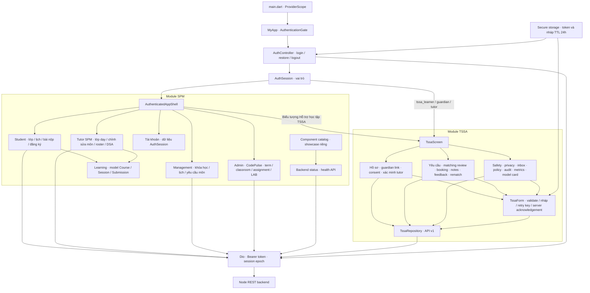
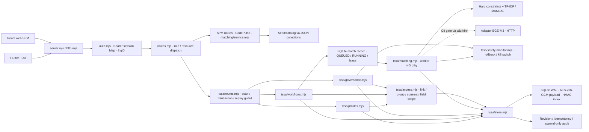
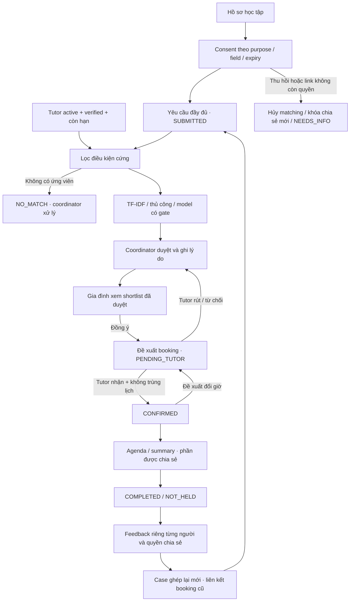

# Bản đồ module SPM-mobile và TSSA

Đối chiếu source và kiểm thử ngày **04/10/2026**. Kết quả chạy nằm trong [báo cáo kiểm thử](../tssa/validation-report.md). TSSA là domain hỗ trợ học tập theo báo cáo Autism; SPM là các luồng lớp/môn học hiện có.

## 1. App Flutter

### Source và trách nhiệm

| Module | Source | Trách nhiệm thực tế |
|---|---|---|
| Bootstrap/theme | `lib/main.dart`, `lib/app/` | ProviderScope, auth gate, theme, reset toàn bộ route khi logout/expiry, reduce motion |
| Core | `lib/core/{config,networking,security}/` | API base URL, Dio, token, 401/locked, draft TTL, đổi epoch để loại dữ liệu phiên cũ |
| Auth | `lib/features/auth/` | Login, restore session, logout server/local, chuẩn hóa role SPM và role TSSA riêng |
| Navigation/account | `lib/features/navigation/` | Tab SPM theo role; `IndexedStack` giữ màn hình; account hiện dùng AuthSession, chưa là module profile CRUD riêng |
| Student | `lib/features/student/` | Lớp, lịch, bài nộp, đăng ký của student |
| Tutor SPM | `lib/features/tutor/` | Các lớp được giao, nội dung môn có quyền sửa, danh sách lớp, bài nộp/điểm, thống kê/đánh giá, DSA assignment/LAB |
| Management | `lib/features/management/` | Courses, sessions, registrations, course requests cho coordinator/chairman |
| Admin CodePulse | `lib/features/admin/` | Term/classroom và thao tác CodePulse theo backend authorization |
| Learning | `lib/features/learning/domain/` | Model dùng chung; không phải màn hình hay dịch vụ tự chạy |
| TSSA profiles | `lib/features/tssa/presentation/tssa_profiles.dart` | Learner profile, guardian purpose scopes, consent preview, tutor registry/verification |
| TSSA workflows | `lib/features/tssa/presentation/tssa_workflows.dart` | Requests, coordinator decisions, family choices, bookings, notes, feedback, rematch |
| TSSA governance | `lib/features/tssa/presentation/tssa_governance.dart` | Case receipt, privacy export/delete, inbox/preferences, policy/roles/audit/model/metrics |
| TSSA common/data | `tssa_form.dart`, `tssa_ui.dart`, `data/tssa_repository.dart` | Form, draft/retry, polling/lifecycle, trạng thái và gọi `/api/v1` |
| Health/showcase | `lib/features/{backend_status,component_catalog}/` | Health API và UI tham khảo riêng; dữ liệu showcase không phải hồ sơ nghiệp vụ |

SPM dùng các lớp `presentation → application → data/domain`. TSSA hiện dùng `presentation → TssaRepository` với Map payload; chưa có lớp typed domain/application tách riêng. Đây là cấu trúc hiện có, không phải đề xuất đã được triển khai.

## 2. Backend và dữ liệu

- Các module backend trên chạy trong **một tiến trình Node**, không phải microservices riêng.
- Matching SPM cũ và matching TSSA là hai đường xử lý khác nhau. TSSA có job bền vững trong SQLite và worker nội bộ; không dùng message broker bên ngoài.
- Web tham chiếu `/course/13` là UI SPM. Không suy ra web đã có toàn bộ màn hình TSSA từ việc backend có `/api/v1`.
- SQLite lưu account, binding, learner, tutor, link, consent, request, run, decision, booking, note, feedback, case, privacy request, inbox, preferences, effort, policy và model card. Audit/idempotency có bảng riêng.
- Session token vẫn ở RAM; restart giữ hồ sơ/job nhưng yêu cầu đăng nhập lại. Mã hóa DB không chứng minh backup, ACL hay quản lý key production đã được kiểm duyệt.

## 3. Luồng nghiệp vụ chính

Tutor chỉ mở learner profile sau khi nhận booking, với consent còn hiệu lực và đúng field. Guardian có quyền `feedback/requests` nhưng thiếu `schedule` chỉ thấy booking receipt; quyền `consent` không tự cấp quyền đọc giá trị profile. Mọi quyền thật được kiểm tra tại backend.

## 4. Tab TSSA theo vai trò

| Vai trò | Tab 1 | Tab 2 | Tab 3 | Tab 4 |
|---|---|---|---|---|
| Learner / Guardian | Hồ sơ | Yêu cầu | Lịch | Hỗ trợ |
| Tutor TSSA | Hồ sơ | Ca được mời | Lịch | Hỗ trợ |
| Coordinator | Queue | Xác minh | Lịch | Hỗ trợ |
| Admin | Quản trị | Audit | Chất lượng | Hỗ trợ |
| Unassigned | Chọn vai trò tự đăng ký | — | — | — |

TSSA chọn trang theo tab, có polling và reload theo lifecycle. SPM shell dùng `IndexedStack`; không gán hành vi giữ state của SPM cho TSSA.

## 5. Giới hạn đã xác định

Kiểm thử tự động và các lần chạy live được ghi riêng trong [validation-report.md](../tssa/validation-report.md). Các quyết định tổ chức, usability với người đại diện, push provider, backup/retention và chất lượng model thật chưa được chứng minh bằng các test này. Policy/model mặc định vẫn khóa theo evidence gate.
