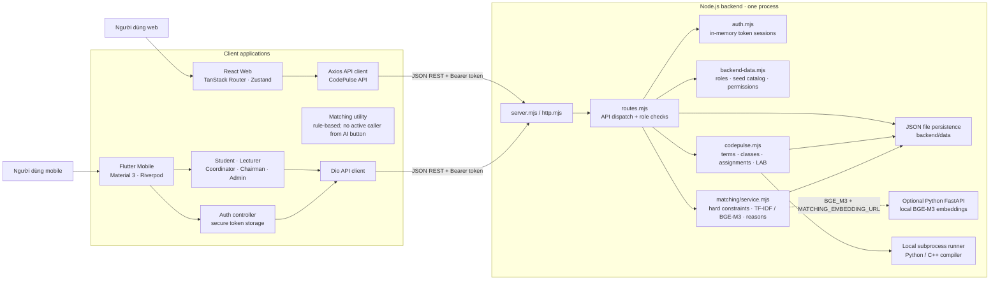
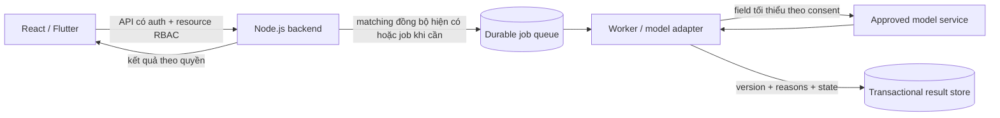
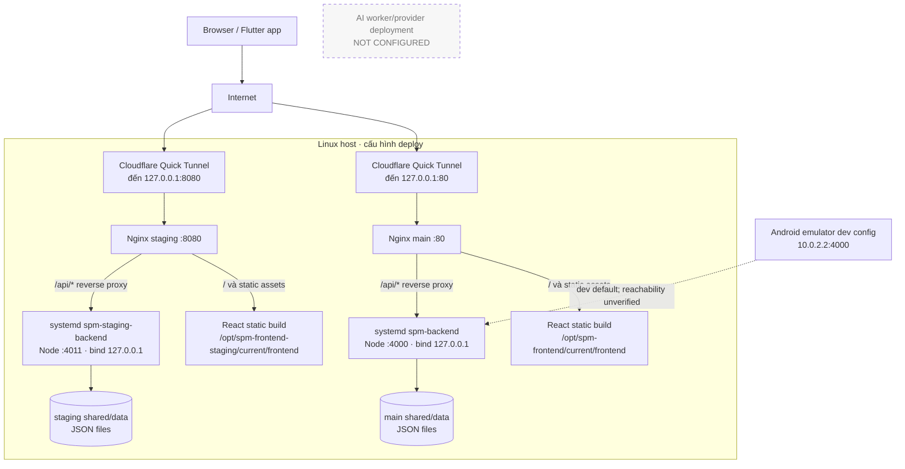

# Kiến trúc hệ thống SPM

> Tài liệu được đối chiếu với source trong `SPM-mobile` và sibling repository
> `SPM-frontend` vào ngày 2026-10-03. Đây là kiến trúc suy ra từ source và các
> cấu hình deploy; không phải xác nhận trạng thái runtime của máy chủ đang chạy.
> Backend đã có matching tổng quát; việc chạy BGE-M3 phụ thuộc service local và
> checkpoint. Chưa xác nhận inference hoặc deployment production.

## 1. Tóm tắt kiến trúc

Hệ thống hiện có hai ứng dụng client gọi chung một backend:

- **React Web**: React 19, TypeScript, Vite, TanStack Router, Zustand và Axios.
- **Flutter Mobile**: Flutter, Riverpod, Dio và `flutter_secure_storage`.
- **Backend**: Node.js ESM dùng `node:http`, xử lý REST API và authorization
  trong cùng một tiến trình.
- **Matching backend**: hard filters, TF-IDF mặc định, tùy chọn BGE-M3 local,
  recommendation, coordinator decision, assignment và feedback.
- **CodePulse**: module DSA/LAB được gọi nội bộ từ backend; không phải một
  microservice riêng.
- **Lưu trữ**: một phần dữ liệu đến từ seed/catalog trong source; các collection
  có thể thay đổi được lưu thành JSON files trên máy backend.

Vì vậy, kiến trúc hiện tại là **hai client + modular monolith backend**, không
phải microservices. Matching chạy đồng bộ trong request Node. Backend có adapter
tùy chọn đến một Python FastAPI local embedding service, nhưng source không kèm
database server hoặc durable message broker và chưa xác nhận model/service đang
chạy.

## 2. Component diagram — hiện trạng trong source

Đường liền là luồng nghiệp vụ có trong source. BGE-M3 là nhánh tùy chọn được gọi
qua adapter khi được cấu hình; không đồng nghĩa đã khởi chạy thành công.

### 2.1 Các module và trách nhiệm

| Ứng dụng       | Module                                                  | Trách nhiệm và ranh giới hiện tại                                                                                                                    |
| -------------- | ------------------------------------------------------- | ---------------------------------------------------------------------------------------------------------------------------------------------------- |
| React Web      | `frontend/src/app`, `features`                          | Khởi tạo router; các route login/private; trang dashboard, course, schedule, registration, overview, library, statistics và CodePulse.               |
| React Web      | `services/api-client.ts`, `services/codepulse-api.ts`   | Axios client, gắn Bearer token, chuyển lỗi API; wrapper cho API thường và CodePulse.                                                                 |
| React Web      | `stores/`, `components/study-layout/`                   | Zustand persist cho auth/user; layout và một số chat/notification UI dùng store phía client. UI không đồng nghĩa đã có backend persistence/realtime. |
| React Web      | `utils/matching.ts`                                     | So khớp theo giao nhau subject, language, session type và location. Đây là rule-based utility; source hiện không chứng minh có model AI.             |
| Flutter Mobile | `lib/app/`, `lib/core/`                                 | Auth gate, theme, base URL, Dio interceptor và token storage. Riverpod điều phối state/provider.                                                     |
| Flutter Mobile | `features/auth/`, `features/navigation/`                | Login/restore session; tab được chọn dựa trên role lấy từ backend. Backend vẫn quyết định quyền thật.                                                |
| Flutter Mobile | `features/student/`, `features/tutor/`                  | Màn hình học viên và lecturer: courses, sessions, submissions, registrations.                                                                        |
| Flutter Mobile | `features/management/`, `features/admin/`               | Coordinator/chairman: course requests, sessions, registrations; admin: CodePulse terms/classrooms.                                                   |
| Flutter Mobile | `features/learning/domain/`                             | Model dùng chung như Course và ClassSession. `component_catalog` là showcase tĩnh, không phải nguồn dữ liệu thật.                                    |
| Backend        | `server.mjs`, `http.mjs`, `routes.mjs`                  | Tạo HTTP server, parse/serialize JSON, điều hướng endpoint, xác thực Bearer và kiểm tra role/resource permission.                                    |
| Backend        | `auth.mjs`, `data/seeds.mjs`, `domain/backend-data.mjs` | Token session, tài khoản/role seed, chuẩn hóa role, dữ liệu catalog và permission view.                                                              |
| Backend        | `codepulse.mjs`                                         | API CodePulse: classroom, membership, assignment/version, LAB/practice window, workspace và submission/run. Chạy bên trong tiến trình backend.       |
| Backend        | `matching/contracts.mjs`, `hard-constraints.mjs`, `features.mjs`, `service.mjs` | Chuẩn hóa registration, hard eligibility, TF-IDF mặc định hoặc BGE-M3 tùy chọn, xếp hạng và candidate reasons.                                      |
| Backend        | `matching/embedding-provider.mjs`, `ai-service/app.py` | Adapter gọi embedding endpoint local, kiểm model/revision; Python service chỉ nạp BGE-M3 từ local cache.                                            |
| Backend        | `data/storage.mjs`, `config.mjs`                        | Collection JSON, seed khi thiếu file, tuần tự hóa thao tác ghi trong một tiến trình; cấu hình port và thư mục dữ liệu.                               |

Các route backend được xác nhận trong source gồm auth/health, courses/course
detail/submissions, memberships, sessions, registrations, course requests,
`/api/codepulse/*` và `/api/matching/*`. Matching endpoints hiện dùng đăng ký
student/tutor chung của SPM; không suy ra có learner autism profile, guardian
consent, chat/notification server hay safeguarding case chỉ từ các route này.

### 2.2 Luồng đăng nhập và gọi API

1. Client gửi `POST /api/auth/login`.
2. Backend kiểm tra user fixture, tạo token Bearer và trả user cùng role.
3. Web persist token bằng Zustand/localStorage; mobile lưu access token bằng
   `flutter_secure_storage`.
4. Client gửi `Authorization: Bearer …`; khôi phục phiên bằng
   `GET /api/auth/me`.
5. `routes.mjs` suy ra user/role từ token, rồi áp dụng quyền phía server.
   Tab/route ẩn ở client chỉ là điều hướng, không phải security boundary.
6. Dữ liệu nghiệp vụ trả về client; các collection được hỗ trợ ghi sẽ persist
   bằng JSON files theo `BACKEND_DATA_DIRECTORY`.

Token được giữ trong một `Map` trong bộ nhớ backend và có thời hạn 8 giờ. Khởi
động lại backend làm mất session đang tồn tại. Mobile có thể còn token trong
secure storage nhưng phải gọi `/api/auth/me`; 401 mới khiến app xóa token đã hết
hạn.

Web đang gọi login email/password qua API. `GoogleOAuthProvider` được mount ở
React app nhưng luồng Google login trong trang login đang comment/chưa nối với
backend; không xem đó là OAuth integration đã hoàn tất.

`AuthSession.fromJson` của Flutter đọc `accessToken`, `role` và object `user`
trong response. Role không nhận diện được ánh xạ sang `unknown`; navigation của
role này chỉ mở trang tài khoản, không tự cấp quyền cho một nhóm màn hình khác.

## 3. Matching hiện có và phần TSSA cần bổ sung

### 3.1 Matching backend đã có trong source

- Backend có `/api/matching/recommendations`, `/api/matching/assignments`,
  `/api/matching/recommendations/:id/decision` và `/api/matching/feedback`.
  Recommendation chỉ dành coordinator/chairman; feedback cho coordinator,
  chairman và participants được xác minh theo assignment.
- `matching/service.mjs` chuẩn hóa registration, chạy hard constraints trước
  semantic scoring, rồi xếp candidate bằng TF-IDF word/bigram mặc định hoặc
  BGE-M3 embeddings nếu request chọn model và embedding service được cấu hình.
  Topic-fit/style-fit dùng Jaccard; feature khả dụng được lấy trung bình đều.
- Hard constraints hiện có: môn, ngôn ngữ, mode, location cho học trực tiếp,
  availability overlap/timezone khi student khai báo availability, tutor
  capacity. Route chỉ đưa approved tutor và request student còn mở vào service.
- `profile-extractor.mjs` dùng taxonomy/regex trên registration text để trích
  topic/style/availability. Candidate response lưu reasons/evidence,
  excluded reasons, model/version metadata và khai báo score không phải xác suất.
- TF-IDF chạy trong Node. BGE-M3 adapter gọi `MATCHING_EMBEDDING_URL`; service
  `ai-service/app.py` cung cấp `/health` và `/v1/embeddings`, tải checkpoint từ
  cache local với `local_files_only=True`, revision được pin. Chưa xác nhận
  model cache, service process hay BGE-M3 request runtime trong môi trường.
- `matching/evaluate.mjs` và dataset schema có bộ khung offline ranking
  evaluation. Có evaluator không xác nhận đã có kết quả benchmark, dataset
  đại diện hoặc quality cho học sinh tự kỷ.
- `/api/matching/*` hiện không được Flutter gọi trong `SPM-mobile/lib/` và
  không thấy UI recommendation/coordinator decision ở app. Coordinator ACCEPT
  tạo assignment ACTIVE trực tiếp; chưa có consent/family/learner choice step.
- TSSA cần profile mục tiêu học và điều chỉnh do user chọn, guardian consent,
  verification/safeguarding tutor, scoped coordinator, learner/family decision,
  audit và lifecycle rematch. Không đưa trường chẩn đoán vào ranking mặc định.

Kết luận: **matching backend tổng quát đã tồn tại; trạng thái chạy của BGE-M3 và
chất lượng cho TSSA chưa được xác minh.** Frontend web còn helper/nút mô phỏng
riêng, còn Flutter chưa gọi matching API. Tên nút hoặc field trạng thái không
đủ để khẳng định một workflow đã được nối end-to-end.

### 3.2 Kiến trúc mở rộng TSSA -- chưa implement

Đối với TSSA, mở rộng matching sau backend API, không để Flutter/React gọi thẳng
model. Tách matching generic hiện có khỏi domain TSSA; thêm consent-aware input,
tutor verification, family choice, coordinator scope, audit và persistence giao
dịch. Nếu cần inference bất đồng bộ, bổ sung queue/worker sau khi đo được nhu cầu.

Đây là **target design cho mở rộng TSSA**, không phải cách matching chạy hiện
tại. Source hiện tính ranking đồng bộ trong route Node và chỉ BGE-M3 mới gọi
service local; không có durable queue/worker. CodePulse analysis là luồng khác
domain. Trước production cần retry/idempotency nếu async, audit, consent-aware
input, retention/deletion, model-off switch và không đưa secret vào app.

## 4. Deployment diagram — cấu hình được khai báo trong repository

Sơ đồ dưới đây mô tả đường self-host có trong `deploy/nginx`, `deploy/systemd`
và script deploy. Nó **không xác nhận các service đang active trên server**.

### 4.1 Ý nghĩa và giới hạn deployment

- Main được khai báo với Nginx `:80` → static React và `/api/*` → backend
  `127.0.0.1:4000`; dữ liệu đặt tại
  `/opt/spm-frontend/shared/data`.
- Staging dùng Nginx `:8080` → backend `127.0.0.1:4011`; dữ liệu riêng tại
  `/opt/spm-frontend-staging/shared/data`.
- Cloudflare Quick Tunnel units được cấu hình trỏ lần lượt vào Nginx main và
  staging. Đây là cấu hình trong repository; URL/tình trạng tunnel thực tế chưa
  được kiểm tra ở lần rà soát này.
- React self-host dùng same-origin `/api` qua Nginx. `frontend/Dockerfile` cũng
  tồn tại như một cách build/serve static khác; deploy scripts self-host hiện
  copy `frontend/dist` vào release và dùng host Nginx.
- Flutter đặt mặc định `API_BASE_URL=http://10.0.2.2:4000` cho Android emulator,
  trong khi backend source bind `127.0.0.1`. Chưa có production API URL/TLS
  được xác nhận cho mobile. Với điện thoại thật/production, cần cấu hình URL
  HTTPS công khai đi qua reverse proxy và kiểm thử từ đúng thiết bị.
- Backend yêu cầu Node.js 20 trở lên theo `backend/package.json`. CodePulse cần
  Python/Python 3 cho assignment Python và `g++` hoặc `clang++` cho C++; các
  deploy scripts đã đọc không cài các compiler này.
- Script frontend còn khai báo Firebase deploy commands; không có bằng chứng
  trong source đã kiểm tra cho thấy đây là đường deploy đang chạy cùng backend
  hiện tại.
- Source hiện không khai báo deployment node cho matching embedding service,
  AI worker hoặc queue; service Python được source code mô tả là local-only.

## 5. Đặc tính dữ liệu và các điểm cần lưu ý

| Chủ đề               | Hiện trạng trong source                                                                        | Hệ quả kiến trúc                                                                                                                                                                   |
| -------------------- | ---------------------------------------------------------------------------------------------- | ---------------------------------------------------------------------------------------------------------------------------------------------------------------------------------- |
| Catalog/users        | Một phần được định nghĩa bằng seed/static source.                                              | Không xem mọi dữ liệu là CRUD database thật.                                                                                                                                       |
| Collection nghiệp vụ | JSON files; data directory có thể đổi qua environment.                                         | Cần backup, khóa/đồng bộ nếu nhiều tiến trình; chưa có DB replication.                                                                                                             |
| Session              | Token map trong RAM, TTL 8 giờ.                                                                | Restart backend yêu cầu xác minh/đăng nhập lại; chưa thấy refresh/revoke store bền vững.                                                                                           |
| Code execution       | Backend spawn Python hoặc C++ compiler/runtime trong temp directory; chạy đồng bộ với request. | Deployment cần runtime tương ứng. Source có timeout/output checks nhưng không cho thấy container/OS sandbox riêng; phải cô lập trước khi xử lý code không tin cậy trên production. |
| Matching / AI        | Backend có TF-IDF default; tùy chọn BGE-M3 local embeddings; version metadata và offline evaluator source. | Chưa có benchmark được xác nhận, integration Flutter, autism-specific profile/consent, fairness evaluation hoặc production inference evidence.                                       |

## 6. Source map để tiếp tục học

### Flutter — repository hiện tại (`SPM-mobile`)

- `lib/main.dart` → entrypoint.
- `lib/app/app.dart` → `MaterialApp` và auth gate.
- `lib/core/config`, `networking`, `security` → API URL, Dio và token storage.
- `lib/features/auth` → login, restore session, model `AuthSession`.
- `lib/features/navigation` → role destinations và `NavigationBar`/`IndexedStack`.
- `lib/features/student`, `tutor`, `management`, `admin` → màn hình theo role.
- `lib/features/learning/domain` → model chia sẻ cho feature.

### React/backend — sibling repository (`SPM-frontend`)

- `frontend/src/main.tsx`, `app/index.tsx`, `features/` → khởi tạo React và route/page.
- `frontend/src/services/api-client.ts`, `codepulse-api.ts` → HTTP clients.
- `frontend/src/utils/matching.ts` → matching rule-based cần phân biệt với AI.
- `backend/server.mjs`, `http.mjs`, `auth.mjs`, `routes.mjs` → HTTP/auth/API dispatch.
- `backend/domain/backend-data.mjs`, `backend/data/` → domain, seeds và persistence.
- `backend/matching/` → normalization, hard constraints, feature score, TF-IDF/BGE-M3 adapter và ranking evaluator.
- `backend/ai-service/app.py` → optional local-only embedding endpoint; không phải hosted inference SaaS.
- `backend/codepulse.mjs` → module CodePulse cùng runner.
- `deploy/nginx/`, `deploy/systemd/`, `deploy/bin/` → cấu hình self-host main/staging.

Các feature, route hoặc deployment chỉ được ghi nhận là “đang có” khi thấy
đường thực thi trong source. Mock, fixture, label UI và kế hoạch AI không được
xem là tích hợp backend đã hoàn thành.

## 7. Định hướng Tutor Support System for Autism

Đặc tả mục tiêu cho mobile app, gồm source review backend/Flutter, user
story/acceptance criteria, module, luồng coordinator, matching AI, privacy và
kế hoạch pilot được quản lý tại [`docs/reports/main.tex`](../reports/main.tex).
PDF render tương ứng ở
`output/pdf/tutor-support-system-autism-main.pdf`.

Đây là đề xuất sản phẩm mới, không phải mô tả feature đã có trong source. Jira
board `SCRUM` được đọc ở lượt trước chứa các Story CodePulse DSA/LAB; chúng khác
domain nên không được giữ làm yêu cầu của hệ thống hỗ trợ tutor cho học sinh tự
kỷ. CodePulse hiện vẫn là module DSA/LAB riêng trong mobile/backend. Nếu nhóm
muốn đổi hoặc gỡ module đó khỏi app, cần cập nhật source/backlog riêng. Nghiên
cứu feasibility kinh doanh và số liệu chi tiết vẫn ở
[`docs/reports/business-feasibility-autism-tutor-matching-vi.tex`](../reports/business-feasibility-autism-tutor-matching-vi.tex).
